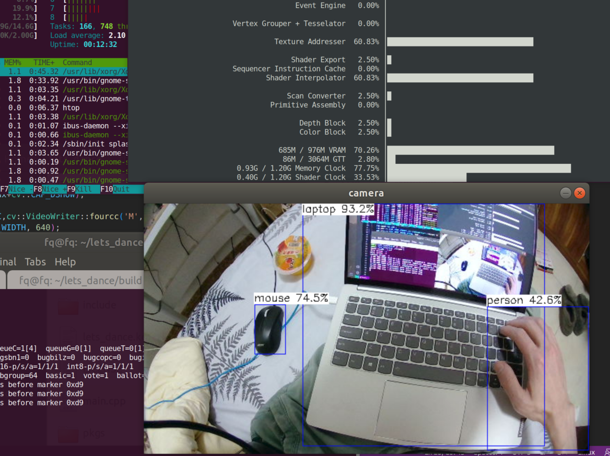

# CV_lib_Cmake_framework
a cv-lib framework contain : OpenCV \ NCNN \ Eigen3 and more over vill come soon. support:
1. executable file generate; (*.a; *.lib; *.exe; [also] *.so; *.dll)
2. OpenCV
3. ncnn
4. Eigen3
5. ubuntu with OpenCV src
6. visual studio 2019 with OpenCV prebuild static lib
7. raspberry pi 4B runs ok with ncnn_rebuilded(appoint ncnn_DIR in CMakeLists.txt)
 

# Current Status:
support cmake_from_source_on_ubuntu and prebuild_static_lib_on_visual_studio_2019_without_vulkan. 

# TBD:
1. ~~config ncnn from *.a or src~~(finish)
2. config c++ GUI api,such as https://github.com/cycfi/elements
3. better module organization
4. onnx runtime support
5. libtorch support
6. PCL \ Vulkan support
7. **Current visual studio 2019 cmake build opencv_static_lib as debug mode. So, currently use prebuild static_lib instead.**

# what can it do
a basic lib framework; friendly for iterator; a quick demo runs on familiar platform.

# How to use
## For Ubuntu:
### Notice before start
P.S: 
1. Building opencv may take some time ..
2. Anaconda may cause some conflict. please disable anaconda by:
> conda deactivate  
> mv \~/anaconda3/lib \~/anaconda3/lib_bck
3. compile and test pass on ubuntu(both Intel and AMD is ok) \ raspberry pi 4B . 

### Step 1:(for opencv)
step 1.1
>sudo apt install build-essential cmake git pkg-config libgtk-3-dev 
    libavcodec-dev libavformat-dev libswscale-dev libv4l-dev 
    libxvidcore-dev libx264-dev libjpeg-dev libpng-dev libtiff-dev 
    gfortran openexr libatlas-base-dev python3-dev python3-numpy 
    libtbb2 libtbb-dev libdc1394-22-dev libopenexr-dev 
    libgstreamer-plugins-base1.0-dev libgstreamer1.0-dev  

step 1.2

> git clone https://github.com/F-Quasimo/CV_lib_Cmake_framework.git 
> cd CV_lib_Cmake_framework  
> mkdir build 
> cd build 
> cmake .. 
> make -j12
### Step 2:(for ncnn)
if cmake from ncnn source :
>sudo apt install build-essential git cmake libprotobuf-dev protobuf-compiler libvulkan-dev vulkan-utils  
>https://github.com/Tencent/ncnn/wiki/how-to-build#build-for-linux

**esle:(Prefer)**
>sudo apt install mesa-vulkan-drivers  
>Download ncnn release package at https://github.com/Tencent/ncnn/releases with ".a" lib, unzip to thirdparty directory. which means you will get XXX/thirdparty/ncnn/bin path etc. 
>I prepare a ncnn release pkg in pkgs, and it will automatically unzip to thirdparty/ncnn. if you need gpu support ,just install vulkan driver is ok.

PS: change the ncnn directory name from "ncnn-XXXXXXXX-ubuntu-1804" to right one and rewrite ncnn_DIR in CMakeLists.txt

# RUN:
> cd /CV_lib_Cmake_framework/bin  
> ./ocvdemo xxx

 make sure the LD_LIBRARY_PATH is updated while running your exectable in the bin/ folder.

## For Windows

### install visual studio 2019
### Step1: opencv and ncnn *.lib is ready in thirdparty/xxx
1. you may have to modify or rebuild ncnn with MT mode if necessary
2. you may have to modify or rebuild opencv static_lib if necessary

### Step2: cmd cmake or cmake-gui to generate build folder and project

### Step3: open visual studio 2019 project and run.

# Reference
https://github.com/Tencent/ncnn/wiki/how-to-build#build-for-linux
https://github.com/Tencent/ncnn

# One more thing
For AMD GPU: 
https://github.com/clbr/radeontop is equal to nvidia-smi